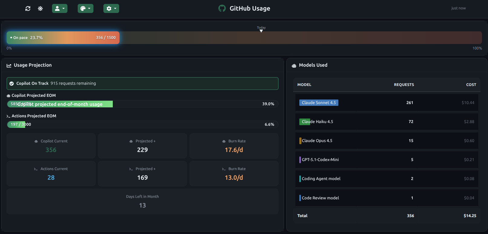
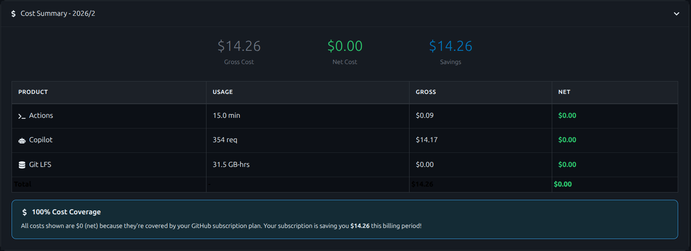
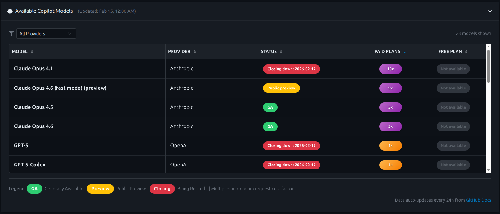

# GitHub Usage Dashboard

A self-hosted React application for visualizing GitHub Actions and Copilot Premium Request usage. Features real-time usage tracking, cost breakdowns, server-side persistent storage, and multiple theme options.

   

## Screenshots

<p align="center">
  
</p>

<p align="center">
  
</p>

<p align="center">
  
</p>

## Features

- **Real-time Usage Tracking**: Monitor GitHub Actions minutes and Copilot Premium Requests
- **Cost Breakdown**: View gross costs, net costs, and subscription savings
- **Usage Projection**: Burn-rate projection to end-of-month based on rolling 7-day history
- **Available Models**: Auto-updating list of all GitHub Copilot AI models with premium request multipliers
- **Visual Analytics**: Progress bars and charts showing usage distribution
- **Multiple Themes**: 5 built-in color themes (Default, Ocean Blue, Sunset, Forest, Purple Haze)
- **Responsive Design**: Mobile-friendly interface built with Bootstrap 5
- **Profile Management**: Add multiple GitHub profiles via secure GUI — tokens stored AES-256-GCM encrypted on the server
- **Server-side Storage**: All profiles, usage history, and settings stored in SQLite — consistent across all devices
- **Unlimited History**: Daily usage snapshots retained indefinitely (no cap)
- **Dockerized Deployment**: Multi-stage build producing a single nginx + Node container
- **CI/CD Ready**: Jenkins multibranch pipeline with manual tag-based deployments

## Architecture

### Tech Stack

| Layer | Technology |
|---|---|
| Frontend | React 19, Bootstrap 5, React-Bootstrap, Recharts |
| Backend | Node.js, Express 4, better-sqlite3 |
| Database | SQLite 3 (WAL mode, persisted on Docker volume) |
| Security | AES-256-GCM token encryption, shared API key auth (`X-API-Key`) |
| HTTP Client | Axios with retry logic |
| Web Scraping | Node.js + Cheerio (auto-updating models) |
| Background Jobs | dcron (inside container, daily model updates) |
| Serving | nginx (static SPA + reverse proxy to Express on port 3001) |
| Deployment | Docker multi-stage build (node:18-alpine builder → nginx:alpine production) |
| CI/CD | Jenkins multibranch pipeline, manual tag-based deployments |

**For detailed diagrams and component interactions, see [Architecture Documentation →](docs/ARCHITECTURE.md)**

### Container Layout

Inside the container both nginx and the Express API server run together:

```
nginx:alpine (port 80)
  ├── /                  → serves React SPA from /usr/share/nginx/html
  └── /api/*             → reverse-proxied to Express on 127.0.0.1:3001

Express (port 3001, internal only)
  ├── GET  /api/health
  ├── /api/profiles      → profile CRUD, encrypted token storage
  ├── /api/usage         → daily usage snapshots (upsert + history)
  └── /api/settings      → key/value settings store

SQLite DB
  └── /data/quota.db     → mounted from Docker named volume
```

### API Endpoints Used (GitHub)

1. `GET /users/{username}/settings/billing/usage/summary` — monthly aggregated usage
2. `GET /users/{username}/settings/billing/premium_request/usage` — Copilot Premium Requests by model

### Internal REST API (`/api/*`)

All requests require the `X-API-Key` header (value = `API_SECRET_KEY` env var).

| Method | Path | Description |
|---|---|---|
| GET | `/api/health` | Liveness check |
| GET | `/api/profiles` | List all profiles |
| POST | `/api/profiles` | Create profile (encrypts token) |
| PUT | `/api/profiles/:id` | Update profile |
| DELETE | `/api/profiles/:id` | Delete profile |
| GET | `/api/profiles/:id/token` | Retrieve decrypted token (server-side only) |
| POST | `/api/usage` | Upsert daily snapshot |
| POST | `/api/usage/batch` | Bulk upsert |
| GET | `/api/usage/:profileId/:metric` | Fetch history (optional `?days=N`) |
| DELETE | `/api/usage/:profileId` | Delete all usage for a profile |
| GET | `/api/usage/db-size` | SQLite file size |
| GET | `/api/settings` | Get all settings |
| GET | `/api/settings/:key` | Get one setting |
| PUT | `/api/settings/:key` | Upsert setting |
| DELETE | `/api/settings/:key` | Delete setting |

## Prerequisites

- Node.js 18+ (for local development)
- Docker (for containerized deployment)
- GitHub Fine-Grained Personal Access Token with **"Plan" (read)** permission
- Jenkins (optional, for CI/CD)

### GitHub Token Setup

This application requires a **fine-grained** Personal Access Token (not a classic PAT).

1. Go to GitHub Settings → Developer settings → Personal access tokens → Fine-grained tokens
2. Click "Generate new token"
3. Set token name, expiration, and resource owner
4. Under "Permissions" → "Account permissions" → select **"Plan"** with **read** access
5. Generate and copy the token (starts with `github_pat_`)

Classic PATs will NOT work — they lack the "Plan" permission.

## Quick Start

### Local Development

1. **Clone the repository**
   ```bash
   git clone <repository-url>
   cd github-quota-viz
   ```

2. **Install dependencies**
   ```bash
   npm install
   ```

3. **Set environment variables**

   Create a `.env.local` file (never committed):
   ```
   REACT_APP_API_KEY=any-local-dev-secret
   API_SECRET_KEY=any-local-dev-secret
   TOKEN_ENCRYPTION_KEY=<64 hex chars>   # generate: openssl rand -hex 32
   ```

4. **Start the Express API server** (terminal 1)
   ```bash
   node server/index.js
   ```

5. **Start the React dev server** (terminal 2)
   ```bash
   npm start
   ```

   The app opens at `http://localhost:3000`. CRA proxies `/api/*` requests to `http://localhost:3001` via the `"proxy"` field in `package.json`.

6. **Add your GitHub Profile**

   Click "Add Profile" and enter your profile name, GitHub username, and fine-grained PAT. The token is validated against GitHub's API before saving and stored AES-256-GCM encrypted in SQLite — it never touches the browser after submission.

### Docker Deployment (Manual)

1. **Build the image**
   ```bash
   docker build -t github-quota-viz .
   ```

   The multi-stage build compiles the React app and native Node addons (`better-sqlite3`) in a `node:18-alpine` builder stage, then copies only the production artifacts into the `nginx:alpine` production stage.

2. **Run the container**
   ```bash
   docker run -d \
     --name github-quota-viz \
     -p 8085:80 \
     --restart unless-stopped \
     -v github-quota-viz-data:/data \
     -e API_SECRET_KEY=<your-api-key> \
     -e TOKEN_ENCRYPTION_KEY=<64-hex-chars> \
     -e REACT_APP_API_KEY=<your-api-key> \
     github-quota-viz
   ```

   - `API_SECRET_KEY` and `REACT_APP_API_KEY` should be the same value — this is the shared secret the browser uses to authenticate with the Express API.
   - `TOKEN_ENCRYPTION_KEY` must be exactly 64 hex characters (32 bytes). Generate with `openssl rand -hex 32`. **Keep this stable** — changing it will invalidate all stored encrypted tokens.
   - The named volume `github-quota-viz-data` persists the SQLite database across container restarts and image upgrades.

3. **Access the dashboard**

   Open `http://localhost:8085`. Add your GitHub profile via the GUI.

4. **Verify the API is running**
   ```bash
   curl http://localhost:8085/api/health
   # {"status":"ok"}
   ```

### With Caddy Reverse Proxy (HTTPS)

If running behind Caddy on a Docker `proxy` network:

```bash
docker run -d \
  --name github-quota-viz \
  --network proxy \
  --restart unless-stopped \
  -v github-quota-viz-data:/data \
  -e API_SECRET_KEY=<your-api-key> \
  -e TOKEN_ENCRYPTION_KEY=<64-hex-chars> \
  -e REACT_APP_API_KEY=<your-api-key> \
  github-quota-viz
```

Omit `-p` when using a proxy network — Caddy handles external traffic.

## Configuration

### Environment Variables

| Variable | Required | Description |
|---|---|---|
| `API_SECRET_KEY` | Yes | Shared secret for `X-API-Key` header auth between browser and Express |
| `TOKEN_ENCRYPTION_KEY` | Yes | 64 hex chars (32 bytes) for AES-256-GCM GitHub token encryption |
| `REACT_APP_API_KEY` | Yes | Injected into `window._env_` at container start — must match `API_SECRET_KEY` |

### Profile Management

Profiles are managed entirely through the GUI:

1. Click the **Profile** button in the top toolbar
2. Click **+ Add/Manage Profiles**
3. Enter profile details and GitHub token
4. The token is validated against GitHub's API before saving

**Security notes:**
- Tokens are encrypted with AES-256-GCM before storage — the plaintext never leaves the server after the initial POST
- The browser never holds a decrypted token; it requests one from the server per-fetch
- The active profile selection is stored in `sessionStorage` (per tab, by design)
- All other data (profiles, usage history, settings) is stored server-side in SQLite and is consistent across all devices

### Theme & Settings

- **Themes**: 5 color themes selectable via the Theme dropdown — persisted in SQLite, consistent across devices
- **Animations**: Glow and pulse effects configurable per-session, persisted server-side

## Usage

### Dashboard Interface

1. **Profile Selector**: Switch between configured GitHub profiles
2. **Theme Selector**: Choose from 5 color themes
3. **Refresh Button**: Reload usage data manually
4. **Usage Progress Bar**: Color-coded bar (green < 70%, yellow 70–90%, red > 90%)
5. **Usage Projection Card**: End-of-month forecast using 7-day rolling burn rate from stored history
6. **Model Breakdown Table**: Copilot requests broken down by AI model
7. **Cost Summary Card**: Gross costs, net costs, and subscription savings
8. **Available Models Card**: Auto-updating list with sortable columns and color-coded multipliers
9. **DB Size Indicator**: Live display of SQLite database file size (polls every 5 minutes)

### Auto-Refresh

The dashboard refreshes usage data every hour. If the browser tab was hidden when the scheduled tick fired, a catch-up refresh runs automatically as soon as the tab becomes visible again (only if ≥60 minutes have passed since the last fetch).

### Usage Projection

The projection card estimates end-of-month usage based on a 7-day rolling burn rate calculated from daily snapshots stored in SQLite. Because history is stored server-side with no cap, projections become more accurate over time and are consistent across all devices hitting the same server.

**Important:** As of v2.1.0, burn rate calculations are **month-aware** and automatically filter out data from previous months. This ensures accurate projections after monthly quota resets on the 1st of each month at 00:00 UTC. [Learn more →](docs/USAGE_PROJECTION.md)

### Available Copilot Models

The **Available Models** card displays all GitHub Copilot AI models:

- **Auto-updating**: Scraped from GitHub Docs every 24 hours via background cron job
- **Provider Filter**: Filter by provider (OpenAI, Anthropic, Google, xAI, etc.)
- **Sortable Columns**: Model, Provider, Status, Paid Plans, Free Plan
- **Premium Multipliers**: Color-coded badges
  - Green: Included (0x) or low cost (≤0.5x)
  - Orange: Medium cost (≤1x)
  - Red: High cost (≤2x)
  - Purple: Premium tier (>2x)
- **Self-contained**: All data served from `/models.json` inside the container — no external API dependencies

## Project Structure

```
github-quota-viz/
├── public/
│   ├── index.html              # HTML template
│   ├── env-config.js           # Runtime env vars (REACT_APP_API_KEY injected at start)
│   └── favicon.ico
├── scripts/
│   ├── scrape-models.js        # GitHub Docs scraper for models data
│   └── start.sh                # Container entrypoint: injects env, starts Express + cron + nginx
├── server/
│   ├── index.js                # Express app (helmet, cors, env validation)
│   ├── db.js                   # SQLite init, WAL mode, schema, AES key sentinel check
│   ├── middleware/
│   │   └── auth.js             # X-API-Key constant-time check
│   └── routes/
│       ├── profiles.js         # Profile CRUD + AES-256-GCM encrypt/decrypt
│       ├── usage.js            # Usage snapshot upsert + history + db-size
│       └── settings.js         # Key/value settings store
├── src/
│   ├── components/
│   │   ├── CopilotProgressBar.js   # Usage progress bar
│   │   ├── ModelBreakdownTable.js  # Copilot model breakdown
│   │   ├── AvailableModelsCard.js  # Available Copilot models
│   │   ├── CostSummaryCard.js      # Cost breakdown
│   │   ├── ProjectionCard.js       # End-of-month usage projection
│   │   ├── DbSizeIndicator.js      # SQLite DB size display
│   │   ├── ProfileModal.js         # Profile management GUI
│   │   └── SkeletonCard.js         # Loading skeletons
│   ├── hooks/
│   │   ├── useSettingsState.js     # Settings hydration from server
│   │   └── useLazyLoad.js          # Intersection Observer lazy loading
│   ├── services/
│   │   ├── apiClient.js            # Axios instance with X-API-Key header
│   │   ├── githubApi.js            # GitHub API calls with retry logic
│   │   ├── profileService.js       # Profile CRUD via REST API
│   │   ├── historicalDataService.js# Usage history via REST API + one-time migration
│   │   ├── modelsService.js        # Models data fetching and polling
│   │   └── themeService.js         # Theme management (server-persisted)
│   ├── App.js                      # Main application, async init, auto-refresh
│   ├── index.js                    # Entry point
│   └── index.css                   # Custom styles
├── .dockerignore
├── .gitignore
├── Dockerfile                      # Multi-stage: node:18-alpine builder → nginx:alpine
├── nginx.conf                      # nginx config: SPA + /api/* proxy_pass
├── Jenkinsfile                     # CI/CD pipeline
├── package.json
└── README.md
```

## SQLite Schema

```sql
-- GitHub profiles with AES-256-GCM encrypted tokens
profiles (id, name, username, token_enc, iv, tag, source, created_at)

-- Daily usage snapshots — one row per profile/metric/date, upserted on each fetch
usage_snapshots (id, profile_id, metric, value, recorded_at, date_str, raw_json)
  UNIQUE(profile_id, metric, date_str)

-- Key/value store for app settings (theme, animations, etc.)
settings (key, value)

-- Schema version tracking
schema_meta (version)
```

## Security

### Token Storage

- GitHub PATs are encrypted with **AES-256-GCM** (32-byte key, random IV per token) before being written to SQLite
- The plaintext token is never stored anywhere after encryption; the browser never holds a decrypted copy
- Token decryption happens server-side only, on demand, for each GitHub API call
- The `TOKEN_ENCRYPTION_KEY` is passed to the container as an environment variable and validated on startup via a key-sentinel check — if the key rotates, the server refuses to start rather than silently serving garbled data

### API Authentication

- All `/api/*` requests require an `X-API-Key` header
- The server uses `crypto.timingSafeEqual` for constant-time key comparison to prevent timing attacks
- The key is injected into the browser's `window._env_` at container startup via `sed` in `start.sh`

### General

- Use HTTPS in production (Caddy or similar reverse proxy handles TLS termination)
- Use fine-grained PATs with minimum required permissions (Plan read only)
- The `.env` file is in `.gitignore` and must never be committed
- Jenkins credentials (`GITHUB_QUOTA_API_KEY`, `GITHUB_QUOTA_ENC_KEY`) hold secrets — never hardcode them

## CI/CD & Deployment

This project uses Jenkins with a **manual tag-based deployment** strategy.

### Continuous Integration (Automatic)

All branches and pull requests are automatically built:

- `main`, `develop`, `feature/*`, `bugfix/*`: Build on every push
- Tags: Discovered but **not auto-deployed** (manual trigger required)

Every push triggers:
1. Branch name validation
2. `npm ci`
3. Linting
4. Tests
5. Production build
6. Docker image build

### Deployment (Manual)

**Only tags trigger deployment.** Required Jenkins credentials:

| Credential ID | Variable | Description |
|---|---|---|
| `GITHUB_QUOTA_API_KEY` | `API_SECRET_KEY` | Shared API key for browser ↔ Express auth |
| `GITHUB_QUOTA_ENC_KEY` | `TOKEN_ENCRYPTION_KEY` | 64 hex chars for AES-256-GCM token encryption |

#### Release Process

1. **Merge to main** via Pull Request from develop
2. **Tag the release**
   ```bash
   git tag v2.1.0
   git push origin v2.1.0
   ```
3. **Trigger in Jenkins** — navigate to the tag and click "Build Now"

Jenkins will:
- Run full CI validation
- Update `package.json` version to match the tag
- Build the Docker image (multi-stage)
- Deploy container with named volume and secrets from credentials store
- Verify deployment via health check

#### Why Manual Trigger?

- Intentional deployments — no accidental production releases
- Full control over timing
- Previous tags remain available for quick rollback

## Troubleshooting

### 401 Unauthorised on all API calls

The browser's `X-API-Key` header doesn't match `API_SECRET_KEY`. Check:

1. `REACT_APP_API_KEY` env var is set on the container
2. The injection ran successfully:
   ```bash
   docker exec github-quota-viz cat /usr/share/nginx/html/env-config.js
   # Should show:  REACT_APP_API_KEY: 'your-key-here'
   ```
3. `REACT_APP_API_KEY` and `API_SECRET_KEY` are the same value

### Express server fails to start (`ERR_DLOPEN_FAILED`)

`better-sqlite3`'s native addon was compiled against a different Node.js version than the one running it. This is resolved in the current Dockerfile by copying the Node 18 binary from the builder stage instead of using `apk add nodejs`. Rebuild the image to pick up the fix.

### Profile Management

**"Token is invalid"**
- Verify it's a fine-grained token (not classic PAT)
- Ensure the token has **"Plan" read** permission
- Check the token hasn't expired or been revoked

**Profiles not appearing after restart**
- Profiles are stored in SQLite on the Docker named volume — they persist across restarts
- If the volume is missing, recreate it: `docker volume create github-quota-viz-data`
- Check Express is running: `curl http://localhost:8085/api/health`

### Container Issues

```bash
# View startup and runtime logs
docker logs github-quota-viz

# Check the API server directly
curl http://localhost:8085/api/health

# Inspect the SQLite DB
docker exec github-quota-viz sqlite3 /data/quota.db ".tables"

# Manual model re-scrape
docker exec github-quota-viz node /app/scripts/scrape-models.js

# Check cron log
docker exec github-quota-viz cat /var/log/cron.log
```

### Build Failures

```bash
# Clear and reinstall dependencies
rm -rf node_modules
npm install

# Verify Node version (18+ required)
node --version
```

## Development

```bash
npm test        # Run tests
npm run lint    # Lint source
npm run build   # Production build → build/
```

## Themes

1. **Default** — Classic GitHub blue
2. **Ocean Blue** — Deep blue ocean tones
3. **Sunset** — Warm orange and purple
4. **Forest** — Green nature-inspired palette
5. **Purple Haze** — Rich purple and pink tones

Theme selection and animation settings are persisted in SQLite and consistent across all devices.

## License

MIT

## Acknowledgments

- Built with [Create React App](https://create-react-app.dev/)
- Charts powered by [Recharts](https://recharts.org/)
- UI components from [React-Bootstrap](https://react-bootstrap.github.io/)
- Icons from [React Icons](https://react-icons.github.io/react-icons/)
- Database via [better-sqlite3](https://github.com/WiseLibs/better-sqlite3)
