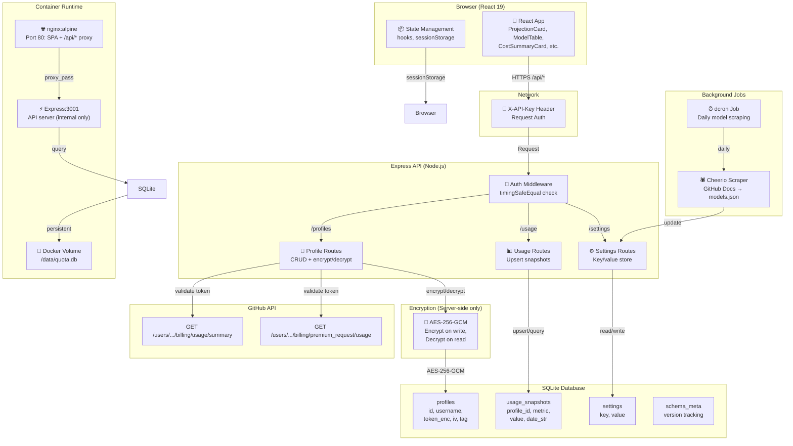
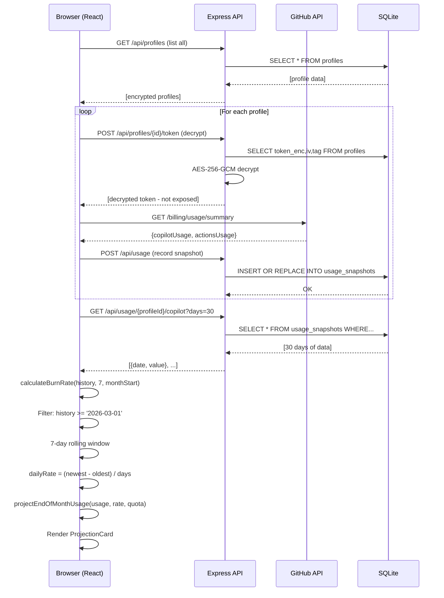
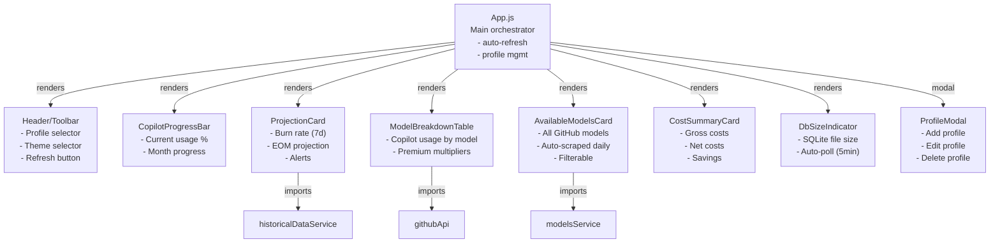
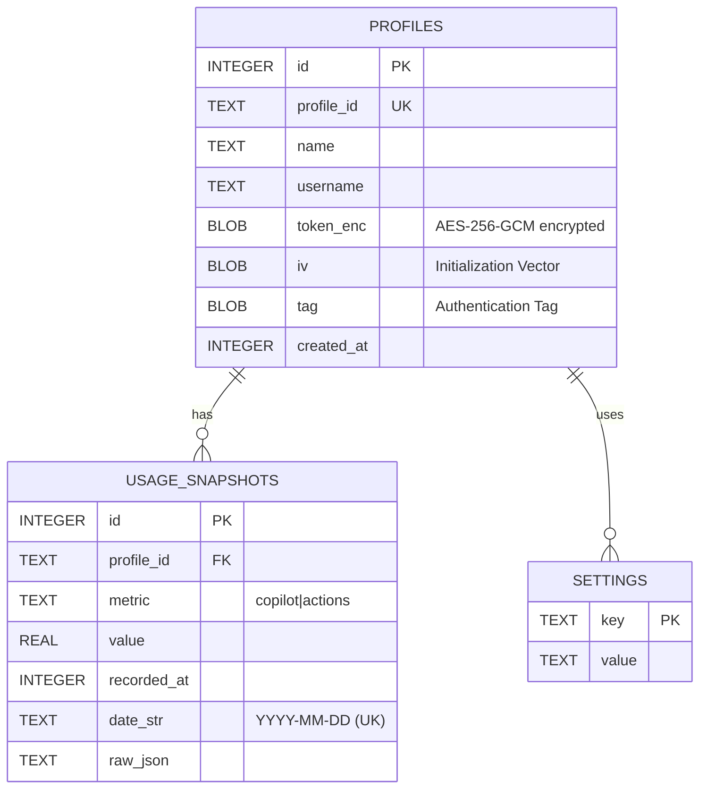
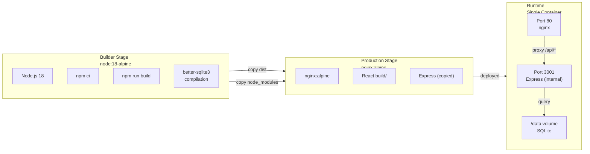
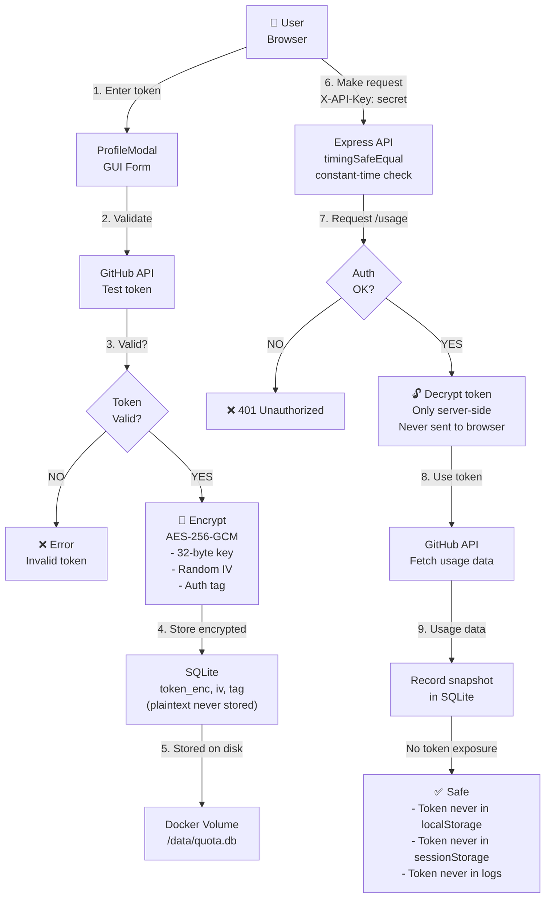
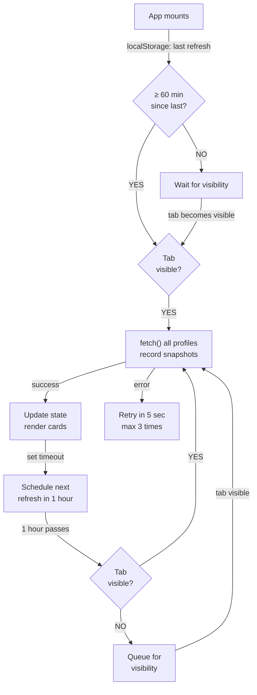

# System Architecture

## Overview

github-quota-viz is a full-stack application for monitoring GitHub usage with server-side persistent storage, encryption, and real-time projections.



## Data Flow: Usage Refresh



## Component Hierarchy



## Burn Rate Calculation (Post v2.1.0)

```mermaid
graph TD
    Start["historicalDataService<br/>getHistoricalData()"]
    
    Start -->|fetch 30 days| SQLite["SQLite<br/>usage_snapshots"]
    
    SQLite -->|return [{date, value}]| History["Array: [{date, value}]<br/>Feb 20 - Mar 20"]
    
    History -->|pass to| BurnRate["calculateBurnRate<br/>(history, 7, monthStart)"]
    
    BurnRate -->|calculate| MonthStart["monthStart = 1st of month<br/>2026-03-01 00:00 UTC"]
    
    MonthStart -->|filter| Filter["Filter history<br/>date >= '2026-03-01'<br/>Result: 20 days (Mar 1-20)"]
    
    Filter -->|check length| Check{"currentMonth<br/>has 2+ points?"}
    
    Check -->|YES| Window["Take last 7 days<br/>OR all if < 7<br/>Result: Mar 14-20"]
    
    Check -->|NO| Fallback["Use last 7 days<br/>of ALL history<br/>isLimited = true"]
    
    Window -->|calculate| CalcRate["dailyRate = (newest - oldest)<br/>÷ daysOfData<br/>= (80 - 20) ÷ 7<br/>= 8.6 req/day"]
    
    Fallback -->|calculate| CalcRate
    
    CalcRate -->|return| Result["{ dailyRate: 8.6,<br/>totalBurned: 60,<br/>daysOfData: 7,<br/>isLimited: false }"]
    
    Result -->|pass to| Projection["projectEndOfMonthUsage<br/>(currentUsage, burnRate, quota)"]
    
    Projection -->|calculate| ProjCalc["projectedTotal<br/>= 80 + (8.6 × 11 days remaining)<br/>= 175 requests"]
    
    ProjCalc -->|render| UI["UI<br/>- Show burn rate: 8.6/d<br/>- Show projection: 175<br/>- Color-code alert"]
```

## Database Schema



## Deployment: Docker Multi-Stage Build



## Security Model



## Auto-Refresh Lifecycle



---

## Key Files by Responsibility

| File | Responsibility |
|------|---|
| `src/App.js` | Main orchestrator, auto-refresh loop, profile lifecycle |
| `src/components/ProjectionCard.js` | Burn rate calculation, EOM projection, alerts |
| `src/services/historicalDataService.js` | Fetch/record usage, calculate burn rate (month-aware as of v2.1.0) |
| `src/services/githubApi.js` | GitHub API calls with retry logic |
| `server/index.js` | Express setup, helmet, CORS, env validation |
| `server/db.js` | SQLite init, WAL mode, schema, AES key validation |
| `server/routes/profiles.js` | Profile CRUD, AES-256-GCM encrypt/decrypt |
| `server/routes/usage.js` | Usage snapshot upsert/query/history |
| `scripts/scrape-models.js` | Daily cron: scrape GitHub Docs for models |
| `Dockerfile` | Multi-stage build |
| `nginx.conf` | SPA serving + /api/* reverse proxy |
